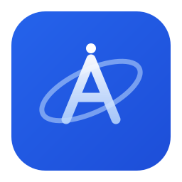

<div align="center">



# AetherAI

**Un cliente de chat de IA de escritorio multi-modelo y local-first · Electron + React + TypeScript**

[English](./README.md) · [简体中文](./README.zh-CN.md) · [繁體中文](./README.zh-TW.md) · [日本語](./README.ja.md) · [español](./README.es.md) · [français](./README.fr.md) · [Deutsch](./README.de.md) · [português](./README.pt.md) · [русский](./README.ru.md) · [українська](./README.uk.md) · [العربية](./README.ar.md) · [हिन्दी](./README.hi.md) · [한국어](./README.ko.md)

</div>

AetherAI unifica varios proveedores de LLM (OpenAI / Claude / DeepSeek / modelos locales / cualquier endpoint compatible con OpenAI) en una sola aplicación de escritorio. Todo se almacena localmente: tus claves API y conversaciones nunca salen de tu equipo excepto hacia los proveedores que configures.

## ✨ Funciones

- **Abstracción multi-proveedor** — una única capa adaptadora; añadir un formato de proveedor significa tocar un solo archivo. Actualmente compatible con OpenAI (cubre OpenRouter, Together, DeepSeek, el shim OpenAI de Ollama, LM Studio, …).
- **Streaming multi-sesión simultáneo** — un chat puede emitir en streaming mientras sigues conversando en otro.
- **Arena** — un prompt, varios modelos responden a la vez; vota por el mejor y una tabla de clasificación ELO se actualiza automáticamente.
- **Personas** — preajustes de prompts del sistema, intercambiables por sesión.
- **Adjuntos** — los archivos de texto se inyectan como contexto; las imágenes van por canal multimodal (requiere un modelo de visión).
- **Colapso de pegado extenso** — pegar cientos de líneas se colapsa automáticamente en un fragmento expandible (estilo ChatGPT).
- **Agent (function calling)** — 13 herramientas integradas (`read_file`, `list_dir`, `glob_find`, `grep_search`, `web_search`, `web_fetch`, `write_file`, `edit_file`, `run_command`, `git_status`, `git_diff`, `memory_save`, `memory_list`) con un bucle Plan→Act→Observe y traza de razonamiento en vivo.
- **Modos de permiso del Agent** — Off / Ask (confirmar cada herramienta de riesgo) / Auto (permitir todo) / Plan (solo lectura). Refleja el modelo de permisos de un agent de programación.
- **Soporte MCP** — conecta servidores MCP externos por stdio; sus herramientas se fusionan con las integradas automáticamente.
- **Deslizador de thinking-effort** — parámetros reales: OpenAI o-series → `reasoning_effort`, Claude → `thinking.budget_tokens`.
- **Resúmenes en la barra lateral** — los títulos son frases temáticas generadas por el modelo (p. ej. "Consejo para el nuevo pull de Eiyuu Angel"), no texto copiado.
- **Ajustes avanzados** — máx. de tokens, temperatura, top_p, prefijo de sistema personalizado, títulos automáticos por idioma.
- **Fondo personalizado** — sube una imagen con controles de opacidad / desenfoque.
- **15 idiomas de interfaz** — English (estándar e invertido), 中文 (简体/繁體/文言), 日本語, español, français, Deutsch, português, русский, українська, العربية (RTL), हिन्दी, 한국어.
- **Temas** — Light / Dark / Blue / Glass / Retro.
- **Almacenamiento local** — todos los datos en una base de datos SQLite local; no se sube nada.

## 🚀 Inicio rápido

### Requisitos previos
- Node.js 18+
- npm 9+

### Instalar y ejecutar
```bash
cd app
npm install
npm run dev      # desarrollo (hot reload)
npm run build    # compilar el frontend de producción
npm start        # lanzar Electron
```

O ejecuta `start.bat` en la raíz del repositorio en Windows.

### Configura tu primer proveedor
1. Tras el arranque, haz clic en **Models** en la barra lateral.
2. Añade un proveedor (nombre / URL de API / API Key).
3. Haz clic en **Fetch models** para obtener la lista de modelos disponibles.
4. Vuelve al chat y empieza a hablar.

## 📁 Estructura del proyecto

```
app/
├── electron/              # proceso principal (Node)
│   ├── database.js        # capa de datos SQLite (sql.js)
│   ├── ipc/               # manejadores IPC (chat / arena / session / mcp / ...)
│   ├── llm/               # abstracción LLM
│   │   ├── providerAdapter.js   # dispatcher por api_format
│   │   ├── openaiAdapter.js     # implementación compatible con OpenAI
│   │   ├── reasoning.js         # constructor de parámetros thinking-effort
│   │   ├── toolLoop.js          # bucle de function-calling
│   │   └── toolArgs.js          # análisis de argumentos de herramientas
│   ├── tools/             # registro de herramientas integradas
│   ├── mcp/               # cliente MCP + gestor
│   ├── main.js / preload.js
├── src/                   # renderer (React + TS)
│   ├── store/index.ts     # estado global zustand
│   ├── components/        # UI (chat / sidebar / settings / ui)
│   ├── pages/             # Chat / Models / Persona / Settings / Scores / ...
│   ├── utils/             # i18n (15 locales) / theme / markdown
│   └── types/
└── package.json
```

## 🔒 Privacidad

**Todos los datos se almacenan localmente.** AetherAI no recopila nada ni sube nada sobre ti. Tus claves API, conversaciones y personas viven en una base de datos SQLite local. Las únicas peticiones de red salientes son hacia los proveedores de LLM que configures.

> ⚠️ Antes de hacer push a GitHub, asegúrate de que `.gitignore` excluye `*.db`, `dist/`, `node_modules/`, `background.img` y cualquier `.env`.

## 📄 Licencia

MIT
